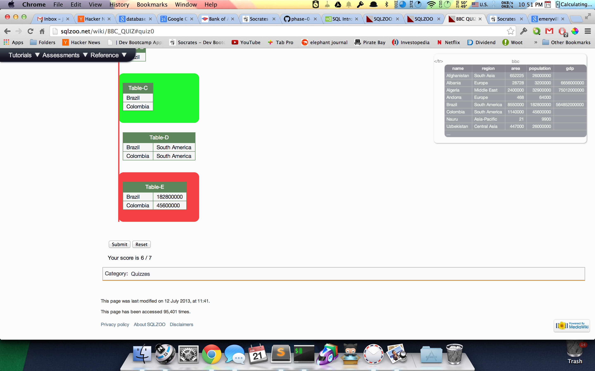
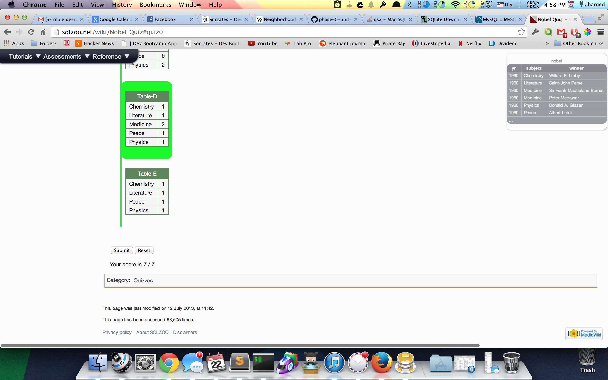
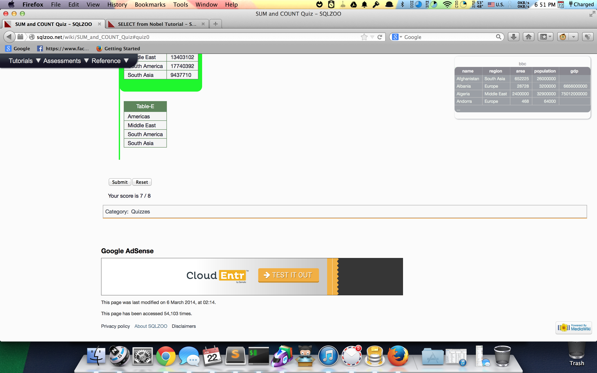
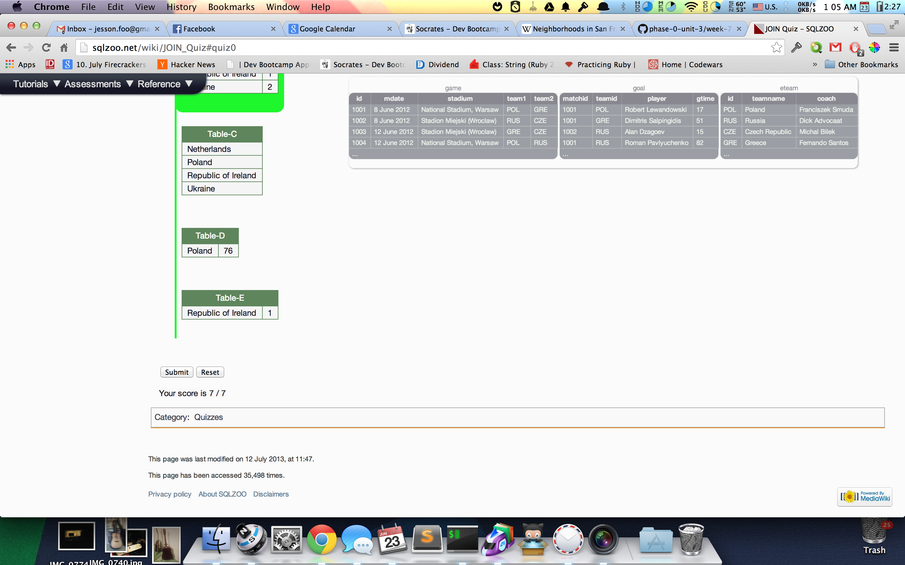

## U3.W7: SQLZoo

####I worked on this challenge [by myself, with: ].

### My Quiz Results:
<!-- Include the link to your image (saved in the imgs folder) to display it inline. -->

### Reflection

At first I was very afraid of SQL, but as I went through the tutorial, I realized it wasnt very hard at all. In fact it was actually really easy. It doesnt feel like a real programming language, but it also feels like it can be hard to become an SQL virtuoso. I thought this challenge was very annoying because the zoosql site would not let me make an account, and I really wanted to track my progress, yet I couldnt. I spent as much time trying to figure out if it was because I hadn't installed sqlite and mysql correctly or if it was the site itself. If the site we were assigned to do this challenge on was better, it would have been a good challenge.