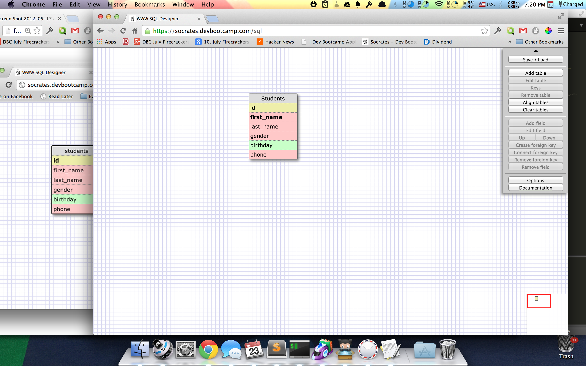

# U3.W7: Designing Schemas

#### I worked on this challenge [by myself, with: ]

## Release 0: Student Roster Schema

## Release 1: One to Many Schema

## Release 2: One to One Schema

## Release 3: Many to Many Schema

## Release 4: Design your own Schema
Description of what you're modeling: 

<!-- display your one-to-one image inline here -->
<!-- display your many-to-many image inline here -->

## Release 5: Reflection
