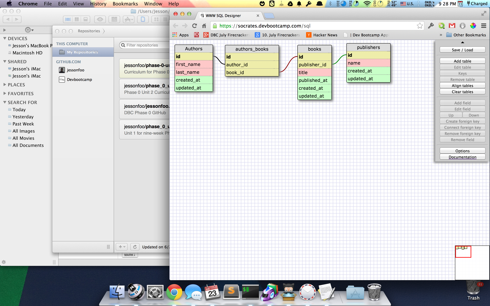

# U3.W7: Designing Schemas

#### I worked on this challenge by myself.

## Release 0: Student Roster Schema

## Release 1: One to Many Schema

## Release 2: One to One Schema

## Release 3: Many to Many Schema

## Release 4: Design your own Schema
Description of what you're modeling: 
I will be modeling an outfit
-an outfit consists of : top wear, bottom, shoes
-each garment has a: brand, style
-each brand has a: name, style, logo

## Release 5: Reflection
This section was not so much difficult, but rather tedious. I spent most of my time thinking of what I could model for my own schema. I finally decided pretty much anything has multiple attributes, and no schema can cover every detail so just choose something. Using the schema editor was intimidating at first, but after a while became rather straightforward.